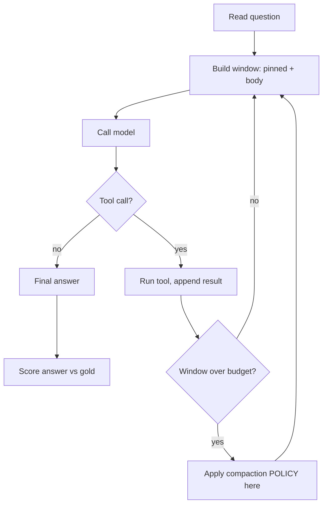
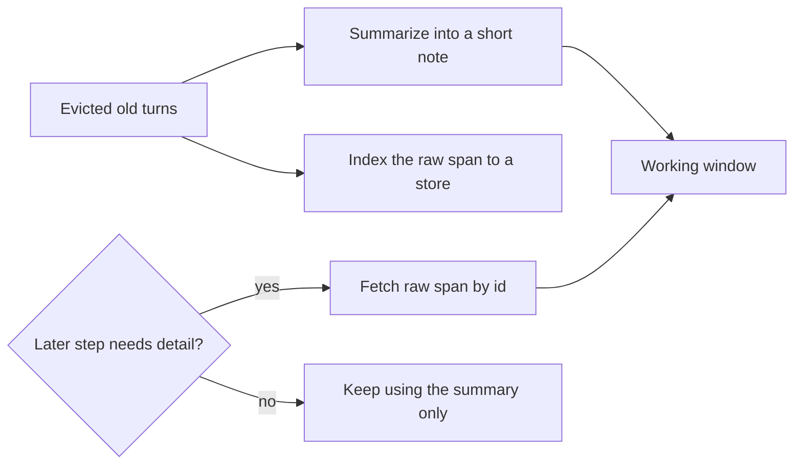
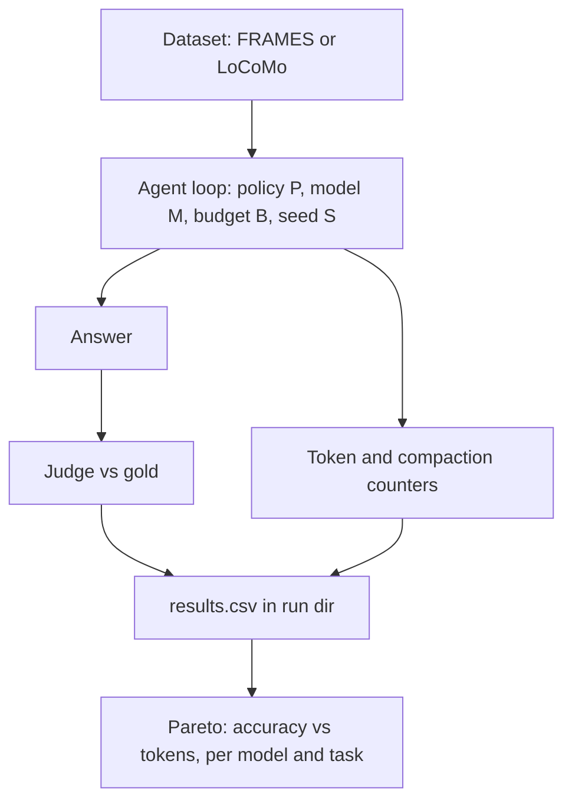

# Methodology and Experimental Plan

*A compaction-policy bake-off across policies, models, and tasks. This document
specifies what we will run, why each choice was made, and what we expect. It is
written so that an engineer can implement it and a reviewer can judge it. Read
[`related-work.md`](related-work.md) first for the motivation.*

---

## 1. The question, in one paragraph

When a long-running agent must throw away context to stay under budget, which way
of throwing it away preserves the most task success per token, and does the answer
depend on the model and the task? Prior work has shown that good compaction nearly
matches full context at a fraction of the cost and that naive compaction destroys
task success, but no one has compared the policies head to head on the same agent,
task, and budget, and no one has swept the model as a variable. We will.

---

## 2. Research questions and hypotheses

We commit to these before running anything, so that a null or surprising result is
still a result rather than a moving target.

- **RQ1. Ranking.** On a real research task, how do the compaction policies rank by
  answer accuracy per token?
  - **H1.** Truncation is the floor. The summarizing policies (recency, importance,
    semantic) cluster well above it. This follows from MemGPT's 92.5 versus 32.1
    split and from Mem0 reaching near full-context accuracy.
- **RQ2. The novel method.** Does the reversible hybrid, which keeps a summary in
  the window and also indexes the raw span for retrieval, beat a summary-only
  policy?
  - **H2.** The reversible hybrid sits on or above the cost-quality frontier. It
    recovers the accuracy that lossy summarization loses, at a modest extra token
    cost when the raw fallback actually fires. This is our main methodological bet.
- **RQ3. Model dependence.** Does the winning policy transfer across models?
  - **H3.** No. The winner differs by model. Small models gain most from aggressive
    compaction (ACON shows up to forty-six percent), large models are less
    sensitive, and reasoning models favor importance and semantic over truncation
    because truncation can sever a chain of thought.
- **RQ4. Task dependence and the empty cell.** Does the winner differ between a
  parallelizable research task and a sequential memory task, and how does
  single-agent compaction compare to sub-agent isolation under an equal budget?
  - **H4.** The winner differs by task. Sub-agent isolation is competitive on the
    research task, where subtopics are independent, and weaker on the memory task,
    where continuity matters. Under an equal token budget, the gap between isolation
    and a well-compacted single agent is far smaller than the raw, unnormalized
    multi-agent results suggest.

If H3 and H4 hold, the paper's headline is not "policy X wins." It is "the optimal
context strategy does not transfer across models or tasks, and here is the decision
map." That is the more defensible and more interesting claim.

---

## 3. The policies (the independent variable)

This is the heart of the design. Each policy is a self-contained rule for what to
do with the evicted middle of the transcript when the window crosses its budget.
All policies plug into the same agent loop at the same point, so the only thing
that varies within a cell is the policy.



| Policy | What it does on the evicted middle | Prior work it draws on | Why it is in the study | What we expect |
|---|---|---|---|---|
| **truncate** | drop the old turns, keep a one-line marker | the trivial baseline | the cost floor; the control everything beats | lowest accuracy, lowest cost |
| **recency-summary** | one summary of the old turns | the policy shipped in Claude Code, LangChain, our harness; recursive summarization (2308.15022) | it is the de-facto default and is unmeasured | strong and cheap; the line to beat |
| **importance-ranked** | keep the few highest-signal turns verbatim, summarize the rest | Selective Context (2310.06201); H2O's heavy-hitter idea (2306.14048) | tests whether keeping facts verbatim beats summarizing them | wins when specific facts matter; can blow the budget if kept turns are large |
| **semantic** | cluster the old turns by topic, summarize each cluster | topic-segmented summarization | tests whether structure-aware summaries help | wins at long run lengths and many topics |
| **externalize** | write findings to a scratchpad, keep a pointer | the scratchpad pattern; MemGPT paging (2310.08560) | the reversible baseline; isolates store from policy | high fidelity, the safety net |
| **retrieve (RAG)** | index fetched text to a vector store, pull relevant chunks per step | RAG (2005.11401); GPT Researcher; Khoj | the long-context-plus-retrieval camp, as a policy | strong on research tasks, sensitive to retrieval quality |
| **sub-agent isolation** | spawn a sub-agent with a fresh window to read a source, return only its summary | Anthropic's research system; Context-Folding (2510.11967) | the multi-agent camp, finally measured against compaction at equal budget | competitive on parallel tasks, costly without a budget cap |
| **reversible-hybrid (ours)** | summarize the middle into the window AND index the exact raw span for fetch-back | SCM stores raw plus summary (2304.13343); the reversible idea from the Redis guide | the novel contribution; never isolated as one in-agent policy | on or above the frontier; recovers lossy's losses |

### 3.1 The reversible hybrid, in detail

This is the only policy that is new, so it deserves its own description. Every other
policy is either lossy, meaning it destroys the evicted text, or it is a pure store,
meaning it never summarizes. The reversible hybrid does both at once and then lets
the agent decide, per later step, whether the summary is enough or the raw text is
needed.



The bet is simple to state. A pure summary is cheap but lossy, and it fails exactly
when a later step needs a detail the summary dropped. A pure store is faithful but
forces a retrieval call on every access. The reversible hybrid keeps the summary
in the window for the common case and pays for retrieval only when the summary is
insufficient. If this is right, it should preserve most of the token savings of
recency-summary while recovering most of the accuracy of full context. We will
measure how often the raw fallback fires and how much accuracy it recovers, which
is the cleanest way to test the reversible-versus-lossy distinction from the
literature.

---

## 4. Why this design is novel

Four things make this more than a benchmark, and each maps to a gap from the
literature review.

1. **It is the controlled bake-off no one has run.** Every camp becomes a policy
   under one harness, with model, task, and budget held fixed. Section seven of the
   review showed the comparison is missing.
2. **It fills the empty cell.** Sub-agent isolation is included as a policy and
   compared against a compaction-engineered single agent at an equal token budget,
   which is the specific comparison the Anthropic-versus-Cognition debate hinges on
   and which has never been measured.
3. **It treats the model as a variable.** Section eight of the review showed the
   best method does not transfer across models, yet no study sweeps the model. We
   do, which turns a ranking into a decision map.
4. **It introduces the reversible hybrid** and measures it head to head against
   summary-only, which isolates the reversible-versus-lossy question.

---

## 5. The models, and why these three

We sweep the model along two axes that the literature says matter most: size and
reasoning style. All three are free on the NVIDIA NIM tier and OpenAI-compatible,
so the study costs no money.

| Model | Role in the design | Why it is included |
|---|---|---|
| `meta/llama-3.1-8b-instruct` | small, non-reasoning | ACON shows small models gain most from compaction; isolates the size effect; fast and cheap for development |
| `meta/llama-3.3-70b-instruct` | large, non-reasoning | the strong model for headline numbers; the literature says large models are less sensitive to compression, so the policy gap should narrow |
| `deepseek-ai/deepseek-r1-distill-llama-70b` | reasoning, same backbone as the 70B | a clean reasoning-versus-standard comparison on identical architecture; reasoning models fill the window faster and risk losing chain-of-thought under truncation |

The 8B-versus-70B pair isolates size with the family held constant. The
70B-versus-R1-distill-70B pair isolates reasoning with the backbone held constant.
This is the cleanest three-model design we can build for free. We deliberately avoid
QwQ-32B, which NVIDIA deprecated on its tier in April 2026.

---

## 6. The evaluation datasets, and the thinking behind them

We use two datasets, chosen so that together they test whether a policy that wins
on one kind of work also wins on a different kind of work. This is the cross-domain
test that the novelty rests on.

**FRAMES** (Google, arXiv:2409.12941) is the research-task domain. Each of its 824
questions requires two to fifteen Wikipedia articles, and the dataset ships the gold
article URLs, so the agent runs as a genuine tool-using researcher that searches,
fetches, and reads. We chose it for five concrete reasons. It is small enough to
evaluate a meaningful subset on a rate-limited free tier. Its answers are graded by
a validated automatic rater that agrees with humans at 0.96, so we need no human
labeling. Fetching several full articles naturally overflows an eight-billion or
seventy-billion-parameter window, which is the condition that makes compaction
matter. Its reported accuracy spread, roughly forty percent for a naive baseline up
to seventy-three percent for an oracle, leaves room for policy differences to show
up in the score. And because its subtopics are partly independent, it is the kind of
task where sub-agent isolation should be competitive, which lets us test H4.

**LoCoMo** (Maharana et al., arXiv:2402.17753) is the memory-task domain. It is ten
long multi-session conversations with about 1,986 checkable question-answer pairs.
We chose it because it is the de-facto benchmark that Mem0 and MemGPT report on, so
our numbers are directly comparable to published work, including the full-context
baseline of 72.9 and Mem0's 66.9. It is cheap, since it is a single file with no web
access. And it is a sequential, continuity-heavy task, the kind where Cognition
predicts that a single continuous thread beats isolation, which is the other half of
the H4 test.

The pairing is the point. FRAMES is parallelizable research. LoCoMo is sequential
memory. If the winning policy is the same on both, that is a strong transferable
result. If it differs, that difference is itself the finding, and it directly tests
the Anthropic-versus-Cognition claim that the right architecture is task-dependent.

A third domain, the tool-agent benchmark tau2-bench (arXiv:2406.12045), is a stretch
goal for after the paper's core, not part of the first two experiments.

---

## 7. Metrics and scoring

We report a small, defensible set of numbers.

- **Primary: end-task accuracy per token.** Accuracy is the FRAMES automatic rater
  or the LoCoMo LLM-judge score. Cost is total tokens billed across the run. The
  headline figure is the quality-versus-cost frontier, one point per policy.
- **Secondary: fidelity.** Did the policy keep the specific fact the question needs
  inside the window? This is the bridge to our needle-recall experiments, and it
  explains why a policy scores as it does rather than only reporting that it does.
- **Cost detail:** total tokens, peak window size, number of compaction events,
  and, for the reversible hybrid, how often the raw fallback fired.
- **The judge:** we use the 70B model as the grader and validate it against the
  FRAMES gold answers on a sample, because LLM judges carry position and verbosity
  biases (Zheng et al., 2306.05685). We report the judge and flag this as a threat.

Every run writes a self-contained directory with a manifest that pins the model,
the config, the seed, and the git commit, plus the full prompt-and-response
transcript, the results table, and the figures. This infrastructure already exists
in the bench package, so reproducibility is built in rather than promised.

---

## 8. Experimental design

The design is a grid. Within any one cell, only the swept variable changes;
everything else is held fixed.



The axes:

- **Policy:** the eight arms of section three.
- **Model:** the three of section five.
- **Task:** FRAMES and LoCoMo.
- **Budget:** at least two token budgets, so we can see where a policy's advantage
  appears as pressure increases rather than at a single arbitrary point.
- **Seed:** at least three, varying question order and any sampling, so the error
  bars are real rather than a single lucky run.

**Cost normalization is non-negotiable.** The multi-agent and retrieval arms can
look better simply by spending more tokens, since the literature shows token usage
alone explains most of the variance in multi-agent results. We therefore hold the
total token budget equal across arms within a cell, so that a win reflects a better
use of the same budget rather than a larger budget. This single control is what
makes the sub-agent comparison meaningful.

We stage the grid rather than running it all at once, because the full grid is
large and the free tier is rate-limited. The staging is in section twelve.

---

## 9. Expected results and what each outcome means

We sketch the expected frontier so that the reader knows what we are looking for.
The vertical axis is answer accuracy, the horizontal axis is tokens spent, and a
policy is better when it sits up and to the left.

```
accuracy
  ^
  |                 reversible-hybrid (our bet: on or above the line)
  |            recency  importance  semantic
  |        externalize
  |   o  o                                  full-context (expensive ceiling)
  | truncate (floor)
  +-------------------------------------------------> tokens
```

The outcomes and their meanings:

- If the summarizing policies cluster near full-context accuracy at far fewer
  tokens, that confirms the field's Pareto-win story on a new, open harness.
- If the reversible hybrid sits above the summary-only policies, the novel method
  works, and the reversible-versus-lossy distinction has a measured payoff.
- If the winning policy is the same across all three models, that is a clean and
  useful transfer result. If it differs, which the literature predicts, the
  decision map is the contribution.
- If sub-agent isolation loses to a compaction-engineered single agent at an equal
  budget, that is direct evidence for the Cognition side of the debate. If it wins
  on FRAMES but loses on LoCoMo, that supports the task-dependent view, which is
  the most likely and most nuanced outcome.

A genuinely possible result is that externalization dominates the policy choice,
meaning the safety net of writing to a store matters more than how you compact what
stays. That would make the headline "compaction policy is second-order, the store
is the move that matters," which is honest, useful, and consistent with the memory
literature. We would report it gladly.

---

## 10. Threats to validity

We list these up front so a reviewer does not have to find them.

- **Judge bias.** LLM judges have known biases. We validate the judge against gold
  answers on a sample and report agreement.
- **Model weakness and floor effects.** The 8B model under-reads. We use it for
  development and the 70B for headline numbers, and we report both.
- **Web nondeterminism.** Wikipedia changes. We cache fetched pages and pin a
  snapshot so a run is reproducible and answers do not drift.
- **Cost normalization for the sub-agent arm.** If we did not cap the budget, the
  multi-agent arm would win by spending more. We cap it, and we say so.
- **Limited seeds in expensive cells.** Some model-by-task cells are costly. We
  report variance where we have it and mark where we do not.
- **Two task domains.** Two is enough to test transfer but not to claim
  universality. We do not over-claim beyond research and conversational memory.
- **Crude heuristic policies.** Importance and semantic use simple heuristics, not
  trained models. This is a deliberate scope choice; a learned compactor is future
  work, and we name it as such.

---

## 11. Cost and feasibility

The money cost is zero, since all three models are free on the NVIDIA NIM tier. The
real costs are wall-clock time, bounded by the forty-requests-per-minute rate
limit, and engineering effort to build the agent harness and the new policy arms.
The response cache makes re-runs free, which is what makes a multi-cell grid
feasible on a free tier at all. A paid endpoint would remove the rate limit for a
total of roughly ten to forty dollars, but it is not necessary if we are patient
and run in the background.

---

## 12. The staged plan

We build confidence in stages, validating the pipeline and the signal before
spending the full grid.

| Stage | What runs | Purpose |
|---|---|---|
| **EXP-003a** | 4 policies (truncate, recency, externalize, reversible-hybrid), FRAMES 100 questions, Llama-8B, 1 seed | prove the agent-on-FRAMES harness works and that policies differ |
| **EXP-003b** | all 8 policies, FRAMES 150 questions, Llama-70B, 3 seeds, 2 budgets | the solid single-model result and the first real Pareto |
| **EXP-003c** | add Llama-8B and R1-distill-70B across the same grid | the model axis and the transfer test |
| **EXP-004** | the strongest policies on LoCoMo, all three models | the second domain and the cross-domain transfer test |

Each stage reuses the existing bench infrastructure, so the new work is the agent
loop on real data, the four new policy arms, and the judge. After EXP-003a we stop
and look at the numbers together before committing to the rest.

---

## 13. What we need to decide before building

Three choices are worth confirming with a human before code, because they shape the
whole grid.

1. The starting subset size for FRAMES, which trades signal strength against time
   on the rate limit. The plan above assumes 100 to 150 questions.
2. Whether to include the sub-agent isolation arm in the first solid run or defer
   it, since it is the most involved to build correctly with a budget cap.
3. Whether the reversible-hybrid store is a simple keyword index or an embedding
   store, since the embedding version is closer to production but adds a dependency.

These are the only open design questions. Everything else in this document is
specified.
